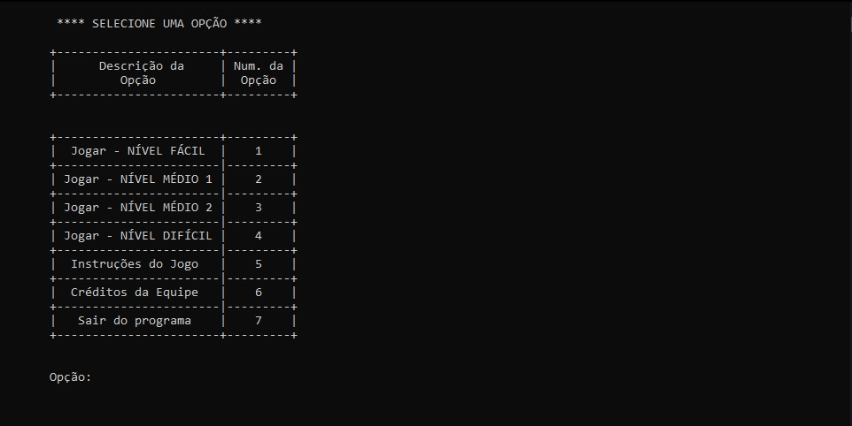
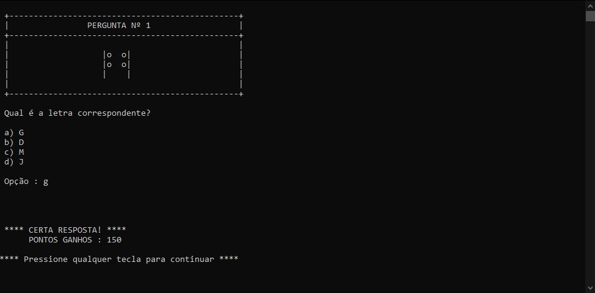
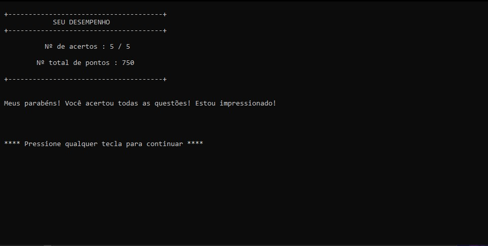
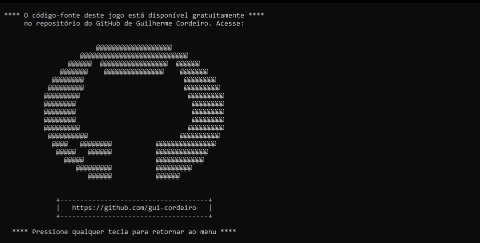

# 🕹️ Jogo do Braile 🕹️
## ♿ Aprenda este importante sistema de escrita tátil de forma simples e divertida! ♿

### O que é o "Jogo do Braile"?
O **"Jogo do Braile"** é um simples jogo de memória sob a forma de *quiz*, cujo objetivo do(a) jogador(a) é acertar o máximo de perguntas possíveis. Ele tem o intuito de ensinar o sistema de escrita tátil "Braile", de forma simples e lúdica, para pessoas sem deficiência visual.

Neste jogo, cada pergunta é composta por:

* Uma letra que será exibida em destaque, escrita de acordo com a grafia do "Braile"; e
* Quatro letras que são as possíveis alternativas, escritas de acordo com o alfabeto latino.

 Para responder tais perguntas, é necessário memorizar as letras que aparecerão na tela por alguns segundos.

> * *Este jogo foi desenvolvido em Linguagem C, como forma de avaliação parcial para o trabalho final do 1º ano do Curso Técnico em Informática, ofertado pelo *Instituto Federal do Paraná - Campus Colombo*. Tal trabalho foi apresentado no ano de 2017 sob o nome **"Acessibilidade dos deficientes visuais na atualidade"**.*

### 👀 **Veja abaixo algumas capturas de tela deste jogo:** 👀

### 1) Imagem do menu principal

### 2) Demonstração das letras em Braile, para que o(a) jogador(a) possa memorizá-las

### 3) Demonstração de uma pergunta

### 4) Exemplo do desempenho final do(a) jogador(a)

### 5) Imagem contendo o link do GitHub do desenvolvedor

